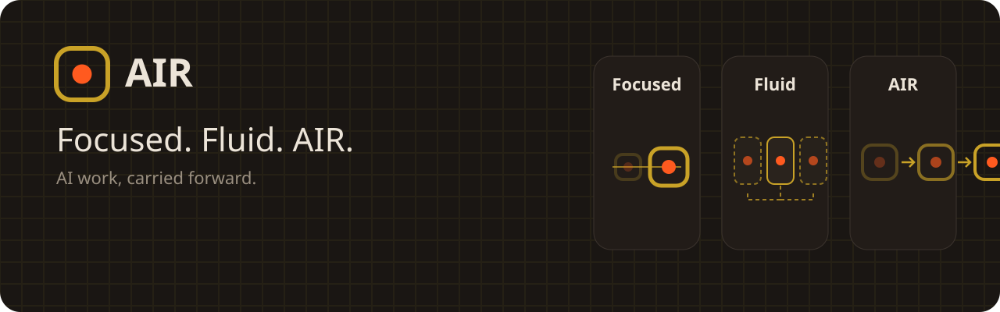
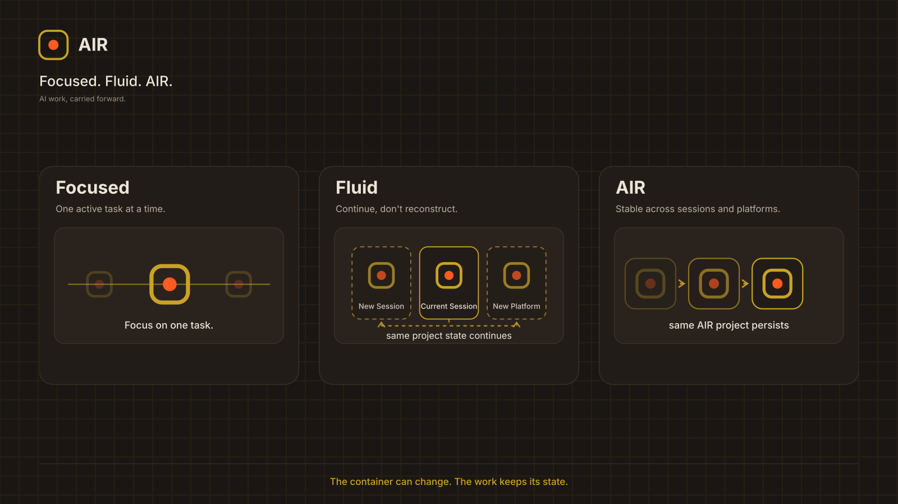

<p align="center">
  <picture>
    <source media="(prefers-color-scheme: light)" srcset="github/readme-header-v2-light.svg">
    
  </picture>
</p>

# AIR by VM4AI — Brand Kit


**Focused. Fluid. AIR.** — AI work, carried forward.

The complete brand system for **AIR**, the prompt-based framework from VM4AI. The mark, typography, and core palette stay constant; the Brand v2 graphic language expresses three states of the work: focused structure, fluid continuation, and provider-independent AIR.

Open **`brand-book.html`** for the full reference: strategy, voice, logo, light/dark color system, typography, state-transition graphic language, motion, diagrams, and usage rules.

---

## Structure

```text
brand/
├─ brand-book.html        the full brand book
├─ brand-ai-brief.md      paste into any AI for on-brand output
├─ USAGE.md               brand mark & stamp usage terms
├─ logos/                 primary · stacked · wordmark · mono · mark · favicon
├─ tokens/
│  ├─ air-tokens.css      color · type · light/dark · @font-face
│  ├─ tokens.json         matching design-token values + brand metadata
│  └─ fonts/              Space Grotesk + JetBrains Mono
├─ web/                   favicon set · site.webmanifest · OG image
├─ social/                X · LinkedIn · GitHub assets and post templates
├─ made-with-air/         attribution stamp
├─ diagrams/              AIR model and Brand v2 state diagrams
├─ templates/             deck · letterhead · email signature · cheat-sheet
└─ github/                README header · divider · section header
```

## Brand center

- **Brand promise:** AI work, carried forward.
- **Signature:** Focused. Fluid. AIR.
- **Focused:** one active task at a time.
- **Fluid:** continue without reconstructing the project.
- **AIR:** the project is not confined to one provider.

## Canonical state diagram

<picture>
  <source media="(prefers-color-scheme: light)" srcset="diagrams/air-three-states-light.svg">
  
</picture>

## Quick start

- **Colors & type** — use `tokens/air-tokens.css`; light and dark are equal brand expressions. Accents stay constant while neutrals invert.
- **Logos** — use the supplied primary light/dark lockups and the unchanged dot-in-frame mark.
- **Fonts** — Space Grotesk for display/body; JetBrains Mono for technical detail.
- **Generating with AI** — paste `brand-ai-brief.md` into the tool before producing AIR material.
- **Motion** — state transition only, never decoration; always provide a reduced-motion/static equivalent.

## Made with AIR

If your project is genuinely built with AIR, add the badge:

```markdown
[](https://vm4ai.com)
```

[](https://vm4ai.com)

## License

The framework code is licensed under **Apache-2.0**. The brand itself — the **AIR** and **VM4AI** names and the dot-in-frame mark — is **not** granted by that license. Do not use the marks to imply endorsement or affiliation. The "Made with AIR" stamp is welcome on genuine AIR-built projects.

— vm4ai.com
